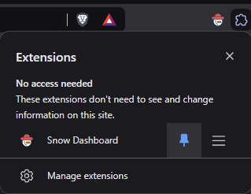

# Follow steps to Install as chrome extension

1. Download extension.zip

2. Now goto browsers extensions page `` chrome://extensions/ ``
3. Drag and drop the downloaded raw extension.zip file
4. Click on extension icon and pin it.

